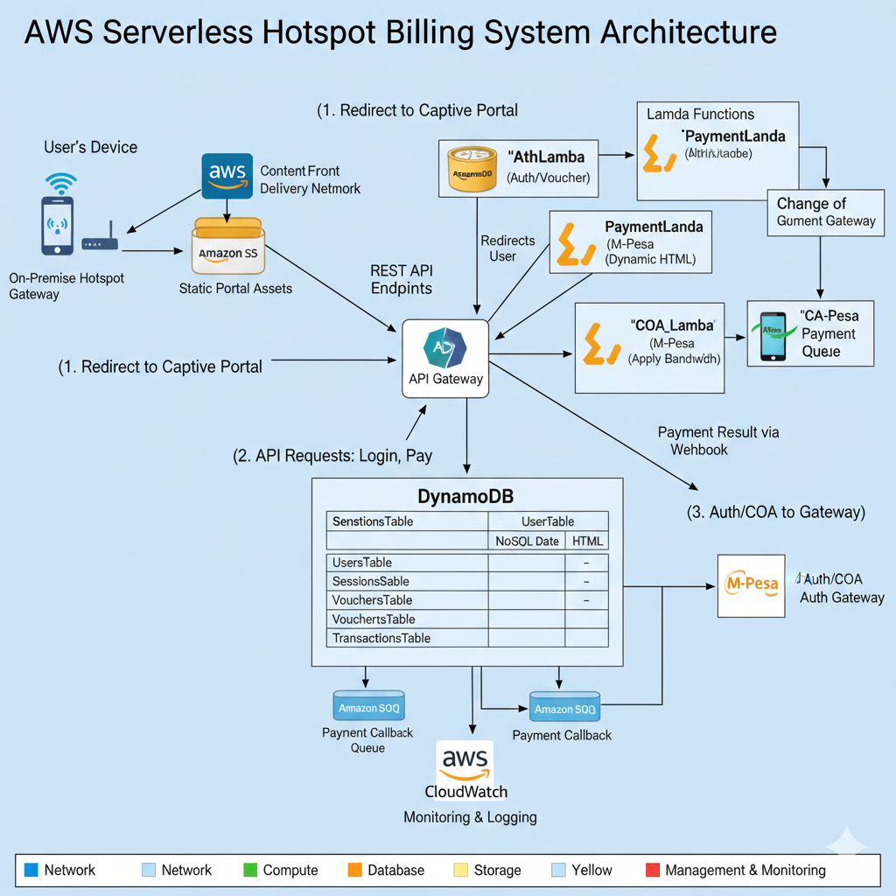
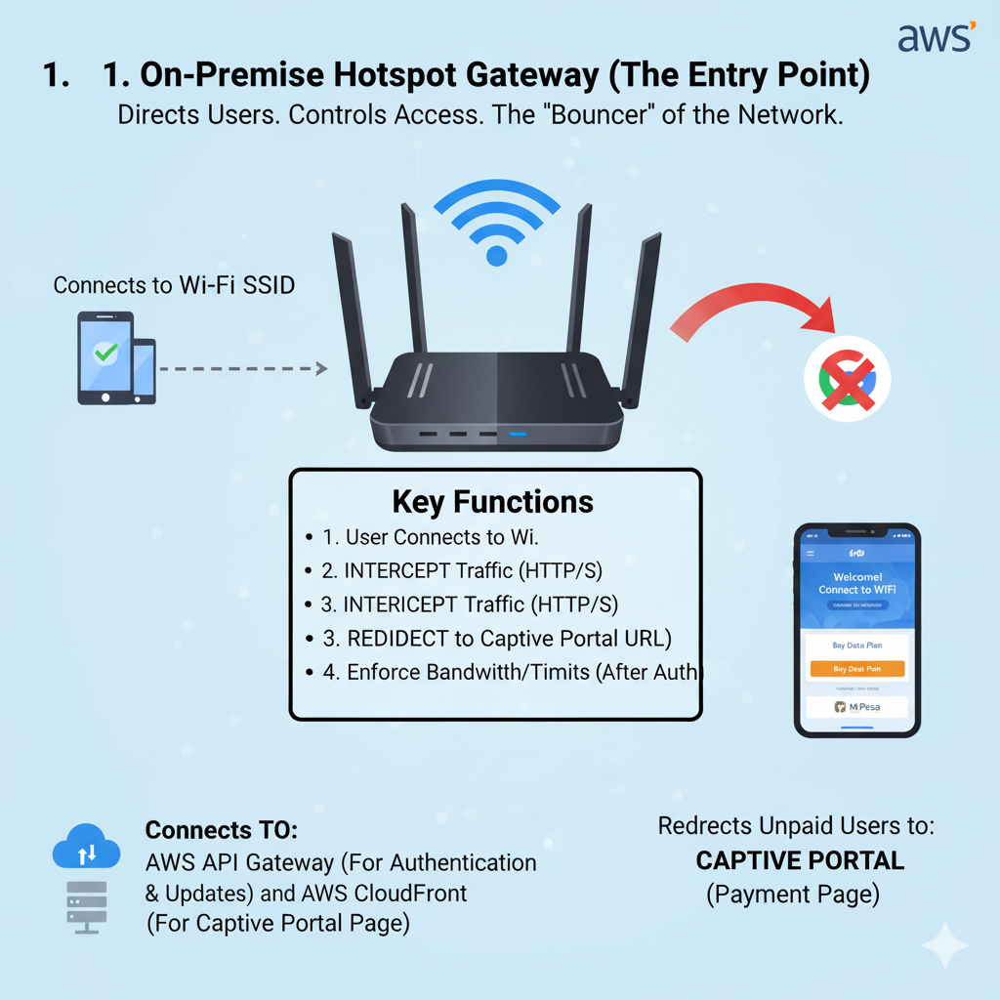

# System Architecture

Comprehensive architecture documentation for the Serverless WiFi Billing System.

## Table of Contents

1. [Overview](#overview)
2. [Architecture Principles](#architecture-principles)
3. [System Components](#system-components)
4. [Data Flow](#data-flow)
5. [Network Architecture](#network-architecture)
6. [Security Architecture](#security-architecture)
7. [Scalability & Performance](#scalability--performance)
8. [High Availability](#high-availability)

---

## Overview

The Serverless WiFi Billing System is built entirely on AWS managed services, eliminating the need for server management while providing automatic scaling, high availability, and pay-per-use pricing.

### Architecture Diagrams


*High-level overview of the serverless architecture.*


*Detailed view of all AWS components and their interactions.*


*CloudFront CDN distribution for captive portal delivery.*


*Network architecture showing gateway and user connections.*


*User interface for billing and payment interactions.*

### Core Principles

- **Serverless-First**: No EC2 instances or container management
- **Event-Driven**: Asynchronous processing via SQS and SNS
- **API-Centric**: RESTful APIs for all interactions
- **Managed Services**: Leverage AWS fully-managed offerings
- **Infrastructure as Code**: AWS SAM for reproducible deployments

---

## Architecture Principles

### 1. **Serverless Computing**
All compute workloads run on AWS Lambda:
- No server provisioning or management
- Automatic scaling from zero to thousands of requests
- Pay only for actual execution time
- Built-in high availability across AZs

### 2. **Event-Driven Architecture**
Components communicate via events:
- **SQS Queues**: Decouple payment callbacks and CoA requests
- **SNS Topics**: Broadcast notifications for alerts
- **DynamoDB Streams**: Trigger actions on data changes
- **EventBridge**: Schedule periodic tasks (cleanup, reports)

### 3. **API Gateway Pattern**
Single entry point for all client interactions:
- RESTful API design
- JWT token authentication
- Rate limiting and throttling
- Request validation
- CORS configuration

### 4. **Microservices**
Each Lambda function has a single responsibility:
- **AuthLambda**: Authentication, authorization, and voucher redemption
- **PaymentLambda**: M-Pesa payment processing and session creation
- **PackageLambda**: Time-based package management (CRUD operations)
- **CoA_Lambda**: Gateway communication with bandwidth rate limits
- **Note**: Session validation integrated into AuthLambda (no separate SessionLambda)

---

## System Components

### AWS Services Used

```
┌─────────────────────────────────────────────────────────────┐
│                       AWS Cloud                             │
│                                                             │
│  ┌──────────────┐      ┌─────────────┐      ┌───────────┐ │
│  │ CloudFront   │──────│ API Gateway │──────│  Lambda   │ │
│  │    (CDN)     │      │  (REST API) │      │ Functions │ │
│  └──────┬───────┘      └─────────────┘      └─────┬─────┘ │
│         │                                          │       │
│  ┌──────▼───────┐                          ┌──────▼─────┐ │
│  │  S3 Bucket   │                          │  DynamoDB  │ │
│  │ (Static Web) │                          │  (NoSQL)   │ │
│  └──────────────┘                          └────────────┘ │
│                                                             │
│  ┌──────────────┐      ┌─────────────┐      ┌───────────┐ │
│  │     SQS      │      │     SNS     │      │ CloudWatch│ │
│  │  (Queues)    │      │  (Pub/Sub)  │      │(Monitoring)│ │
│  └──────────────┘      └─────────────┘      └───────────┘ │
└─────────────────────────────────────────────────────────────┘
```

### 1. **Amazon CloudFront**
- **Purpose**: Global CDN for captive portal
- **Configuration**:
  - Origin: S3 bucket with static assets
  - Cache behaviors: HTML (no-cache), CSS/JS (1 hour)
  - Custom domain with SSL certificate
  - Geo-restriction: Kenya (optional)

### 2. **AWS Lambda Functions**

#### AuthLambda
- **Runtime**: Node.js 18.x
- **Memory**: 512 MB
- **Timeout**: 30 seconds
- **Triggers**: API Gateway
- **Functions**:
  - User login validation
  - Voucher code redemption
  - Session token generation
  - JWT validation

#### PaymentLambda
- **Runtime**: Node.js 18.x
- **Memory**: 1024 MB
- **Timeout**: 60 seconds
- **Triggers**: API Gateway, SQS
- **Functions**:
  - M-Pesa STK Push initiation
  - Payment callback processing
  - Transaction status queries
  - Daraja API token management

#### CoA_Lambda
- **Runtime**: Node.js 18.x
- **Memory**: 256 MB
- **Timeout**: 30 seconds
- **Triggers**: SQS
- **Functions**:
  - Process CoA queue messages
  - Send RADIUS CoA to gateway
  - Handle gateway responses
  - Retry failed CoA attempts

#### PackageLambda
- **Runtime**: Node.js 18.x
- **Memory**: 512 MB
- **Timeout**: 30 seconds
- **Triggers**: API Gateway
- **Functions**:
  - List active packages (public)
  - CRUD package management (admin)
  - Validate package parameters
  - Query by status and price

**Note**: Session management integrated into AuthLambda and PaymentLambda.
Time-based sessions auto-expire via DynamoDB TTL.

### 3. **Amazon API Gateway**

**REST API Configuration:**
```yaml
Stages:
  - dev: Development environment
  - staging: Pre-production testing
  - prod: Production environment

Resources:
  /api/auth/*: Authentication endpoints
  /api/payment/*: Payment processing
  /api/session/*: Session management
  /api/admin/*: Admin operations

Rate Limits:
  - Default: 100 req/sec
  - Burst: 500 requests
  - Per-key: 1000 req/min

Authentication:
  - Type: JWT Authorizer
  - Token Source: Authorization header
  - Validation: RS256 signature
```

### 4. **Amazon DynamoDB**

#### UsersTable
```
Partition Key: phoneNumber (String)
Attributes:
  - userId: String (unique identifier)
  - phoneNumber: String
  - status: String (active/inactive)
  - createdAt: String (ISO 8601)
  - lastLoginAt: String (ISO 8601)

Note: No balance tracking - sessions are time-based and independent
  
Capacity:
  - Billing Mode: On-demand
  - Point-in-Time Recovery: Enabled
  - Encryption: AWS managed key
```

#### SessionsTable
```
Partition Key: sessionId (String)

Attributes:
  - userId: String (phoneNumber)
  - packageId: String
  - packageName: String
  - durationHours: Number
  - bandwidthMbps: Number
  - macAddress: String (device binding)
  - ipAddress: String
  - gatewayId: String
  - startTime: String (ISO 8601)
  - expiresAt: String (ISO 8601)
  - status: String (active/terminated)

Indexes:
  - UserIdIndex (GSI): userId
  - MacAddressIndex (GSI): macAddress (for device binding enforcement)

TTL: expiresAt (auto-delete expired sessions)

Note: No data tracking - time-based billing only
One active session per MAC address enforced
```

#### TransactionsTable
```
Partition Key: transactionId (String)
Attributes:
  - userId: String
  - amount: Number
  - phoneNumber: String
  - status: String
  - mpesaReceiptNumber: String
  - checkoutRequestId: String
  - timestamp: String

Indexes:
  - userId-timestamp-index (GSI)
  - status-timestamp-index (GSI)

Streams: Enabled (for real-time analytics)
```

#### PackagesTable
```
Partition Key: packageId (String)

Attributes:
  - packageId: String (e.g., pkg_standard_3h5mbps)
  - name: String (e.g., "Standard")
  - description: String
  - durationHours: Number (0.5 - 168 hours)
  - bandwidthMbps: Number (1 - 100 Mbps)
  - priceKES: Number (1 - 10000)
  - status: String (active/inactive)
  - createdAt: String (ISO 8601)
  - updatedAt: String (ISO 8601)

Indexes:
  - StatusPriceIndex (GSI): status (HASH) + priceKES (RANGE)
    Purpose: Query active packages sorted by price

Capacity:
  - Billing Mode: On-demand
  - Admin-manageable via API
```

#### VouchersTable
```
Partition Key: voucherCode (String)
Attributes:
  - packageId: String (reference to PackagesTable)
  - status: String (unused/used/expired)
  - createdAt: String
  - usedAt: String
  - usedBy: String (userId)
  - usedByMac: String (device binding)
  - expiresAt: String

Indexes:
  - status-createdAt-index (GSI)

TTL: expiresAt
```

### 5. **Amazon SQS**

#### PaymentCallbackQueue
- **Type**: Standard Queue
- **Visibility Timeout**: 60 seconds
- **Message Retention**: 14 days
- **Dead Letter Queue**: Enabled (3 retries)
- **Purpose**: Buffer M-Pesa callbacks for processing

#### CoA_Queue
- **Type**: FIFO Queue
- **Message Group ID**: gatewayId
- **Deduplication**: Content-based
- **Purpose**: Ordered CoA delivery to gateways

### 6. **Amazon SNS**

#### AlertsTopic
- **Subscriptions**:
  - Email: admin@example.com
  - SMS: +254712345678
- **Filters**: Critical errors, payment failures
- **Purpose**: System monitoring alerts

#### NotificationsTopic
- **Subscriptions**:
  - Lambda (SMS delivery)
  - SQS (email queue)
- **Purpose**: User notifications

### 7. **Amazon S3**

#### Portal Bucket
- **Name**: `wifi-portal-{region}-{account-id}`
- **Website Hosting**: Enabled
- **Contents**: HTML, CSS, JS, images
- **CORS**: Enabled for API calls
- **Encryption**: AES-256

#### Logs Bucket
- **Name**: `wifi-logs-{region}-{account-id}`
- **Lifecycle**: Archive to Glacier after 90 days
- **Contents**: CloudWatch logs, access logs

### 8. **Amazon CloudWatch**

**Metrics:**
- Lambda invocations, errors, duration
- API Gateway requests, latency, 4xx/5xx errors
- DynamoDB read/write capacity
- Custom: Revenue, active sessions, data usage

**Alarms:**
- Lambda error rate > 1%
- API Gateway 5xx > 10 requests/min
- Payment failure rate > 5%
- DynamoDB throttling

**Logs:**
- Lambda execution logs (7-day retention)
- API Gateway access logs (30-day retention)

---

## Data Flow

### 1. User Connection Flow

```
User Device → Hotspot Gateway → Captive Portal
                    ↓
            [Redirect to CloudFront]
                    ↓
            S3 Static Website → User sees login page
```

### 2. Authentication Flow

```
User submits credentials
    ↓
API Gateway → AuthLambda
    ↓
Query DynamoDB UsersTable
    ↓
Validate password hash
    ↓
Generate JWT token
    ↓
Return token to user
```

### 3. Time-Based Payment Flow

```
User selects time-based package (e.g., 3h @ 5 Mbps)
    ↓
API Gateway → PaymentLambda
    ↓
Check device (MAC address) - no active session?
    ↓
Fetch package details from PackagesTable
    ↓
Generate access token from Daraja API
    ↓
Initiate STK Push to user's phone
    ↓
User enters M-Pesa PIN
    ↓
M-Pesa webhook → API Gateway → PaymentLambda
    ↓
Enqueue to SQS PaymentCallbackQueue
    ↓
PaymentLambda processes queue message
    ↓
Update DynamoDB TransactionsTable (status: completed)
    ↓
Create Session in SessionsTable:
    - sessionId, userId, packageId
    - durationHours, bandwidthMbps
    - macAddress (device binding)
    - expiresAt (startTime + duration)
    ↓
Trigger CoA_Lambda via SQS CoA_Queue
    ↓
Send CoA to Gateway with:
    - Bandwidth rate limit (e.g., 5M/5M)
    - Time limit (e.g., 10800 seconds)
    - MAC address binding
    ↓
Gateway grants internet access at specified speed
    ↓
Session auto-expires when time runs out
    ↓
DynamoDB TTL auto-deletes expired session
```

### 4. Device Binding Enforcement

```
User purchases package on Device A (MAC: AA:BB:CC)
    ↓
Session created with macAddress: AA:BB:CC
    ↓
User tries to hotspot to Device B (MAC: DD:EE:FF)
    ↓
Device B connects to WiFi
    ↓
Device B tries to purchase/login
    ↓
PaymentLambda checks MacAddressIndex GSI
    ↓
Finds active session on Device A
    ↓
Rejects: "Device already has active session"
    ↓
User must wait for Device A session to expire
```

### 5. Package Management Flow

```
Admin creates new package
    ↓
POST /api/admin/packages
    ↓
PackageLambda validates:
    - durationHours: 0.5 - 168 hours
    - bandwidthMbps: 1 - 100 Mbps
    - priceKES: 1 - 10000
    ↓
Generate packageId (pkg_name_durMbps)
    ↓
Store in PackagesTable with status: active
    ↓
Package immediately available to users
    ↓
GET /api/packages returns new package
    ↓
Users can purchase via M-Pesa
```

### 5. Admin Dashboard Flow

```
Admin logs in
    ↓
API Gateway → AuthLambda (admin role check)
    ↓
GET /api/admin/stats
    ↓
SessionLambda queries DynamoDB
    ↓
Aggregate metrics
    ↓
Return JSON response
```

---

## Network Architecture

### On-Premise Components

```
┌─────────────────────────────────────────┐
│      Hotspot Gateway (Mikrotik)         │
│                                         │
│  ┌──────────────┐    ┌──────────────┐  │
│  │ RADIUS Client│    │ Walled Garden│  │
│  │  (Optional)  │    │    Rules     │  │
│  └──────────────┘    └──────────────┘  │
│                                         │
│  WAN: Public IP (for API calls)         │
│  LAN: 192.168.1.0/24 (user network)     │
└─────────────────────────────────────────┘
            │
            ▼
      [Internet]
            │
            ▼
┌─────────────────────────────────────────┐
│           AWS Cloud                     │
│  VPC: Not required (public services)    │
└─────────────────────────────────────────┘
```

### Captive Portal Network Flow

1. **User connects to WiFi**
   - DHCP assigns IP (e.g., 192.168.1.100)
   - Gateway blocks all traffic except walled garden

2. **HTTP request intercepted**
   - Gateway redirects to CloudFront URL
   - `https://portal.yourdomain.com`

3. **Portal loads**
   - CloudFront serves S3 static assets
   - JavaScript checks for existing session

4. **API calls**
   - AJAX requests to API Gateway
   - JWT token in Authorization header

---

## Security Architecture

### 1. **Network Security**

- **HTTPS Everywhere**: All communications encrypted
- **API Gateway**: WAF rules for DDoS protection
- **CloudFront**: Origin Access Identity for S3
- **No Public IPs**: Lambda functions in managed AWS network

### 2. **Authentication & Authorization**

```
┌─────────────────────────────────────────┐
│          Authentication Flow            │
│                                         │
│  User Credentials                       │
│         ↓                               │
│  bcrypt password hash check             │
│         ↓                               │
│  Generate JWT (RS256)                   │
│         ↓                               │
│  Token includes:                        │
│    - userId                             │
│    - role (user/admin)                  │
│    - expiry (24h)                       │
│         ↓                               │
│  API Gateway validates token            │
│         ↓                               │
│  Lambda receives decoded claims         │
└─────────────────────────────────────────┘
```

### 3. **Data Security**

- **DynamoDB**: Encryption at rest (AWS managed keys)
- **S3**: Server-side encryption (AES-256)
- **Secrets Manager**: M-Pesa credentials encrypted
- **Parameter Store**: Configuration encrypted

### 4. **API Security**

- **Rate Limiting**: 100 req/min per IP
- **Input Validation**: JSON schema validation
- **CORS**: Whitelist portal domain only
- **M-Pesa Webhook**: IP whitelist for Safaricom

---

## Scalability & Performance

### Auto-Scaling Characteristics

| Component | Scaling Metric | Limits |
|-----------|----------------|--------|
| Lambda | Concurrent executions | 1000 (default), request increase |
| API Gateway | Requests per second | 10,000 (default) |
| DynamoDB | On-demand capacity | No limit |
| CloudFront | Global edge locations | AWS managed |
| SQS | Messages | Unlimited |

### Performance Optimizations

1. **Lambda Cold Start Mitigation**
   - Keep functions warm with CloudWatch Events
   - Provision concurrency for critical functions
   - Minimize bundle size (TypeScript tree-shaking)

2. **DynamoDB Query Optimization**
   - GSI for frequent query patterns
   - Batch operations for bulk reads
   - Connection pooling in Lambda

3. **API Gateway Caching**
   - Cache GET requests (5-minute TTL)
   - Invalidate on data changes

4. **CloudFront Edge Caching**
   - Static assets: 1-day cache
   - API responses: No cache (dynamic)

---

## High Availability

### Multi-AZ Architecture

All AWS services automatically replicate across multiple Availability Zones:

- **DynamoDB**: Multi-AZ replication (synchronous)
- **Lambda**: Deployed in all AZs
- **API Gateway**: Multi-AZ endpoint
- **S3**: Multi-AZ storage class

### Disaster Recovery

**RPO (Recovery Point Objective)**: 5 minutes  
**RTO (Recovery Time Objective)**: 15 minutes

**Backup Strategy:**
- DynamoDB: Point-in-time recovery (35-day window)
- S3: Versioning enabled
- Lambda code: Stored in SAM artifacts bucket

**Failover Procedures:**
1. API Gateway automatically routes to healthy Lambdas
2. DynamoDB auto-promotes secondary index on primary failure
3. CloudFront serves from edge cache during origin outage

---

## Cost Architecture

### Monthly Cost Estimate (1000 active users)

| Service | Usage | Cost |
|---------|-------|------|
| Lambda | 5M invocations/month | $1.00 |
| API Gateway | 5M requests/month | $17.50 |
| DynamoDB | 1M reads, 500K writes | $5.00 |
| CloudFront | 10GB transfer | $0.85 |
| S3 | 1GB storage, 10K requests | $0.30 |
| SQS | 1M messages | $0.40 |
| CloudWatch | 10GB logs | $5.00 |
| **Total** | | **~$30/month** |

**Cost Optimization:**
- Use on-demand DynamoDB (no idle costs)
- Enable S3 Intelligent-Tiering
- CloudWatch log retention: 7 days
- Lambda memory tuning for cost/performance

---

## Monitoring & Observability

### CloudWatch Dashboard

**Widgets:**
1. Active sessions (real-time)
2. Revenue today/week/month
3. Lambda error rate
4. API latency (p50, p99)
5. M-Pesa success rate

### X-Ray Tracing

Enabled for:
- Full request trace (API Gateway → Lambda → DynamoDB)
- Identify bottlenecks
- Debug errors in production

### Custom Metrics

```javascript
// Example: Track payment success rate
await cloudwatch.putMetricData({
  Namespace: 'WiFiBilling',
  MetricData: [{
    MetricName: 'PaymentSuccess',
    Value: 1,
    Unit: 'Count',
    Dimensions: [{
      Name: 'Package',
      Value: 'standard'
    }]
  }]
});
```

---

## Future Enhancements

### Planned Architecture Improvements

1. **Multi-Region**
   - DynamoDB Global Tables
   - Route 53 geo-routing
   - CloudFront multi-origin

2. **Real-Time Analytics**
   - DynamoDB Streams → Kinesis → QuickSight
   - Live dashboard for admins

3. **Advanced Caching**
   - ElastiCache for session state
   - Reduce DynamoDB reads

4. **Serverless GraphQL**
   - AWS AppSync for flexible queries
   - Better mobile app integration

---

## References

- [AWS Lambda Best Practices](https://docs.aws.amazon.com/lambda/latest/dg/best-practices.html)
- [DynamoDB Design Patterns](https://docs.aws.amazon.com/amazondynamodb/latest/developerguide/best-practices.html)
- [API Gateway Security](https://docs.aws.amazon.com/apigateway/latest/developerguide/security.html)
- [AWS Well-Architected Framework](https://aws.amazon.com/architecture/well-architected/)
