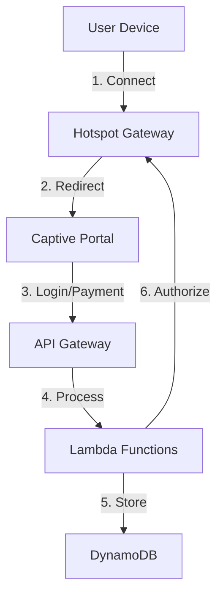

# Architecture Images

This folder contains all architecture diagrams and visual documentation for the WiFi billing system.

## Images

Place your architecture diagrams here following this naming convention:

- `system-overview.png` - High-level system architecture
- `data-flow.png` - Complete data flow diagram
- `component-diagram.png` - AWS components and interactions
- `network-topology.png` - Network architecture
- `payment-flow.png` - M-Pesa payment sequence
- `session-lifecycle.png` - User session states

## Usage in Documentation

Reference images in markdown documents using relative paths:

```markdown

*High-level AWS serverless WiFi billing system overview.*
```

## Image Guidelines

- **Format**: PNG or SVG preferred
- **Size**: Optimize for web (< 500KB per image)
- **Resolution**: 1920x1080 or lower
- **Naming**: Use kebab-case (lowercase with hyphens)
- **Alt Text**: Always provide descriptive alt text

## Tools for Creating Diagrams

- **draw.io** (diagrams.net) - Free diagramming tool
- **Lucidchart** - Professional diagramming
- **AWS Architecture Icons** - https://aws.amazon.com/architecture/icons/
- **Mermaid** - Text-based diagrams in markdown

## Example Mermaid Diagram



---

*Note: Architecture images should be kept up-to-date with system changes.*
